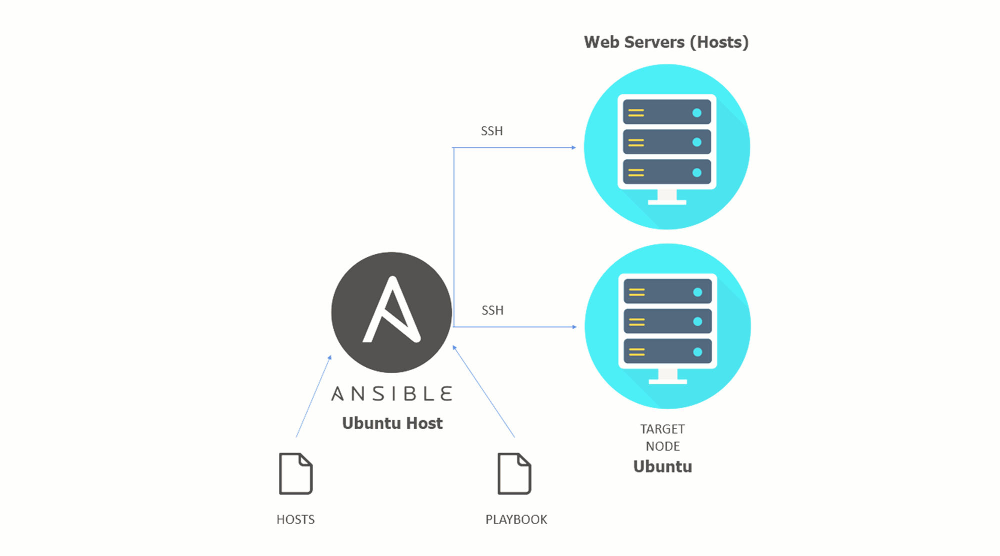

Apache and PHP Deployment using Docker and Ansible - Lab Requirements

Server Requirements >> Minumum 3 Servers (VMs) - on Personal Computer (VMware-Player/Virtual-Box) or Cloud (Azure/AWS/GCP/...)
- 1 Ansible Host (Ubuntu 22.04)
- 2 Ubuntu Hosts (Ubuntu 22.04)
- VM Spec >> 1 vCPU + 1 GB Memory + 10 to 30 GB Storage + IP (Public or Private)

